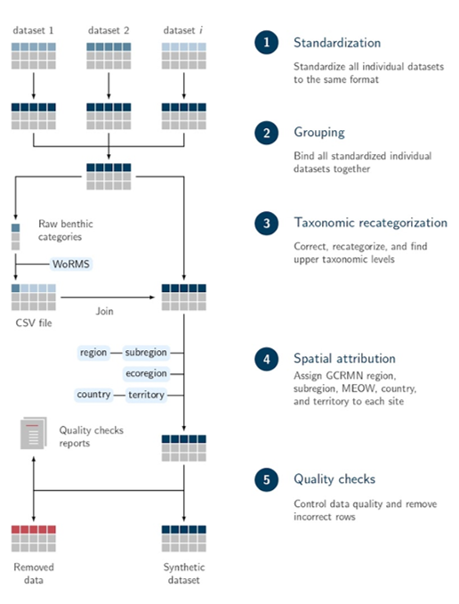

# gcrmndb_benthos 

## Table of Contents

* [1. Introduction](#1-introduction)
  * [1.1 What is the GCRMN?](#11-what-is-the-gcrmn)
  * [1.2 Coral reef monitoring](#12-coral-reef-monitoring)
  * [1.3 Why this repository?](#13-why-this-repository)
  * [1.4 How to contribute?](#14-how-to-contribute)
* [2. Data integration](#2-data-integration)
  * [2.1 Definitions](#21-definitions)
  * [2.2 Workflow](#22-workflow)
* [3. Description of variables](#3-description-of-variables)
* [4. Quality checks](#4-quality-checks)
* [5. List of individual datasets](#5-list-of-individual-datasets)
* [6. Sponsors](#6-sponsors)
* [7. References](#7-references)

## 1. Introduction

### 1.1 What is the GCRMN?

The [*Global Coral Reef Monitoring Network*](https://gcrmn.net/) (GCRMN) is an operational network of the [*International Coral Reef Initiative*](https://icriforum.org/) (ICRI) aiming to provide the best available scientific information on the status and trends of coral reef ecosystems for their conservation and management. The GCRMN is a global network of scientists, managers and organisations that monitor the condition of coral reefs throughout the world, operating through ten regional nodes.

### 1.2 Coral reef monitoring

While coral reefs provide many ecosystem services to human populations and host immense biodiversity, they are directly or indirectly threatened by human activities. To understand what are the main drivers of coral reefs' resilience in the Anthropocene, and to appropriately inform environmental policies that aim to protect these ecosystems, it is necessary to have data describing how coral reef integrity is changing over space and time.

Such data are acquired from ecological monitoring, which consist of repetitive measurements of a specified set of ecological variables at one or more locations over an extended period of time ([Vos *et al.*, 2000](https://link.springer.com/article/10.1023/A:1006139412372)). Coral reef monitoring is usually assessed at local scale by different actors (*e.g.* research institutes, governments, NGOs), using different data standards (*i.e.* using different variable names and units). Hence, it exist numerous heterogeneous datasets based on coral reef monitoring in the world, which represent a major challenge to assess status and trends of coral reefs at larger spatial scales.

### 1.3 Why this repository?

This repository aims to gather individual datasets on benthic cover that have been acquired in the world's coral reefs over the last decades and to integrate them into a unique synthetic dataset. This dataset, named `gcrmndb_benthos`, is used to produce GCRMN reports on status and trends of coral reefs. In addition to its use for the production of GCRMN reports, this dataset can possibly be used for macroecological analyses, although this utilization is restricted to open access individual datasets integrated. Finally, this repository constitutes an inventory of existing data on benthic cover in coral reefs (see **Table 4**), and represents a means to change the culture around data towards the FAIR principles ([Wilkinson *et al.*, 2016](https://www.nature.com/articles/sdata201618)), and to preserve these data for future generations. 

It is important to note that the `gcrmndb_benthos` is a code repository, which consist of a hub to store the code used for data integration, and not a data repository.

The `gcrmndb_benthos` is one of the two synthetic datasets developed and maintained by the GCRMN, the other one is the `gcrmndb_fish`.

### 1.4 How to contribute?

If you would like to contribute to this initiative by providing a dataset on benthic cover monitoring data acquired in coral reefs, you can contact Jérémy Wicquart.

Because the GCRMN is a network based on trust, we are very vigilant regarding data authorship. **You will always remained the owner of the dataset you share** within the `gcrmndb_benthos`. You can control the use that will be made of your dataset by signing a data sharing agreement. Any new use of your dataset made by the GCRMN will be the object of a request sent by email. You are free to remove your dataset from the `gcrmndb_benthos` at any time. Feel free to provide any suggestions by email on the data integration process or unincluded individual datasets.

## 2. Data integration

### 2.1 Definitions

**Table 1.** Definition of main terms used in this README.

| Term                   | Definition                                                                                    | 
|-----------------------:|:----------------------------------------------------------------------------------------------|
| Dataset                | A collection of related sets of information that is composed of separate elements (data files) but can be manipulated as a unit by a computer.         |
| Data aggregator        | Data analyst responsible for the data integration process. |
| Data integration       | Process of combining, merging, or joining data together, in order to make what were distinct, multiple data objects, into a single, unified data object ([Schildhauer, 2018](https://link.springer.com/chapter/10.1007/978-3-319-59928-1_8)).|
| Data provider          | A person or an institution sharing a dataset for which they have been or are involved in the acquisition of the data contained in the dataset. |
| Synthetic dataset      | A dataset resulting from the integration of multiple existing datasets ([Poisot *et al*., 2016](https://onlinelibrary.wiley.com/doi/10.1111/ecog.01941)). |

### 2.2 Workflow

**Figure 1.** Illustration of the data integration workflow used for the creation of the `gcrmndb_benthos` synthetic dataset (see [Wicquart *et al.*, 2022](https://www.sciencedirect.com/science/article/pii/S1574954121003344)). *EEZ* = Economic Exclusive Zone, *NCBI* = National Center for Biotechnology Information.

## 3. Description of variables

**Table 2.** Description of variables included in the `gcrmndb_benthos` synthetic dataset. The icons for the variables categories (`Cat.`) represents :memo: = description variables, :globe_with_meridians: = spatial variables, :calendar: = temporal variables, :straight_ruler: = methodological variables, :crab: = taxonomic variables, :chart_with_upwards_trend: = metric variables. Variables names (except *category*, *subcategory*, and *condition*) correspond to [DarwinCore terms](https://dwc.tdwg.org/terms).

|  #  | Variable              | Cat.                       | Type      | Description                                                                                            |
|----:|:----------------------|:--------------------------:|:----------|:-------------------------------------------------------------------------------------------------------|
| 1   | datasetID             | :memo:                     | Factor    | ID of the dataset                                                                                      |  
| 2   | higherGeography       | :globe_with_meridians:     | Factor    | GCRMN region (see [gcrmn_regions](https://github.com/JWicquart/gcrmn_regions))                         |  
| 3   | country               | :globe_with_meridians:     | Factor    | Country (obtained from [World EEZ v11](https://www.marineregions.org/downloads.php) (*SOVEREIGN1*))    |  
| 4   | territory             | :globe_with_meridians:     | Character | Territory (obtained from [World EEZ v11](https://www.marineregions.org/downloads.php) (*TERRITORY1*))  |  
| 5   | locality              | :globe_with_meridians:     | Character | Site name                                                                                              |  
| 6   | habitat               | :globe_with_meridians:     | Factor    | Habitat                                                                                                |  
| 7   | parentEventID         | :globe_with_meridians:     | Integer   | Transect ID                                                                                            |  
| 8   | eventID               | :globe_with_meridians:     | Integer   | Quadrat ID                                                                                             |  
| 9   | decimalLatitude       | :globe_with_meridians:     | Numeric   | Latitude (*decimal, EPSG:4326*)                                                                        |  
| 10  | decimalLongitude      | :globe_with_meridians:     | Numeric   | Longitude (*decimal, EPSG:4326*)                                                                       |  
| 11  | verbatimDepth         | :globe_with_meridians:     | Numeric   | Depth (*m*)                                                                                            |  
| 12  | year                  | :calendar:                 | Integer   | Four-digit year                                                                                        |  
| 13  | month                 | :calendar:                 | Integer   | Integer month                                                                                          |  
| 14  | day                   | :calendar:                 | Integer   | Integer day                                                                                            |  
| 15  | eventDate             | :calendar:                 | Date      | Date (*YYYY-MM-DD*, ISO 8601)                                                                          |  
| 16  | samplingProtocol      | :straight_ruler:           | Character | Description of the method used to acquire the measurement                                              |  
| 17  | recordedBy            | :straight_ruler:           | Character | Name of the person who acquired the measurement                                                        |  
| 18  | category              | :crab:                     | Factor    | Benthic category                                                                                       |  
| 19  | subcategory           | :crab:                     | Factor    | Benthic subcategory                                                                                    |   
| 20  | condition             | :crab:                     | Character |                                                                                                        |  
| 21  | phylum                | :crab:                     | Character | Phylum                                                                                                 |  
| 22  | class                 | :crab:                     | Character | Class                                                                                                  |  
| 23  | order                 | :crab:                     | Character | Order                                                                                                  |  
| 24  | family                | :crab:                     | Character | Family                                                                                                 |  
| 25  | genus                 | :crab:                     | Character | Genus                                                                                                  |  
| 26  | scientificName        | :crab:                     | Character | Species                                                                                                |  
| 27  | measurementValue      | :chart_with_upwards_trend: | Numeric   | Percentage cover                                                                                       |  

**Table 3.** Description of levels for variables `category` and `subcategory` (see **Table 2**).

| category     | subcategory         | Description                                                        |
|:------------:|:--------------------|:-------------------------------------------------------------------|
| Abiotic      | Rock                |                                                                    | 
|              | Rubble              |                                                                    |
|              | Sand                |                                                                    |
|              | Silt                |                                                                    |
| Algae        | Coralline algae     |                                                                    |
|              | Cyanobacteria       |                                                                    |
|              | Macroalgae          |                                                                    |
|              | Turf algae          |                                                                    |
| Hard coral   |                     |                                                                    |
| Other fauna  |                     |                                                                    |
| Seagrass     |                     |                                                                    | 

## 4. Quality checks

**Table 4.** List of quality checks used for the `gcrmndb_benthos` synthetic dataset. Inspired by [Vandepitte *et al*, 2015](https://doi.org/10.1093/database/bau125). The icons for the variables categories (`Cat.`) represents: :globe_with_meridians: = spatial variables, :chart_with_upwards_trend: = metric variables.

| #  | Cat.                       | Variables                            | Questions                                                                       |
|:--:|:--------------------------:|--------------------------------------|:--------------------------------------------------------------------------------|
| 1  | :globe_with_meridians:     | `decimalLatitude` `decimalLongitude` | Are the latitude and longitude available?                                       |  
| 2  | :globe_with_meridians:     | `decimalLatitude`                    | Is the latitude within its possible boundaries (*i.e.* between -90 and 90)?     |  
| 3  | :globe_with_meridians:     | `decimalLongitude`                   | Is the longitude within its possible boundaries (*i.e.* between -180 and 180)?  |  
| 4  | :globe_with_meridians:     | `decimalLatitude` `decimalLongitude` | Is the site within the coral reef distribution area (100 km buffer)?            |  
| 5  | :globe_with_meridians:     | `decimalLatitude` `decimalLongitude` | Is the site located off lands (5 km buffer)?                                         |  
| 6  | :globe_with_meridians:     | `verbatimDepth`                      | Is the depth between 0 and 100 meters?                                          |  
| 7  | :calendar:                 | `year`                               | Is the year available?                                                          |  
| 8  | :chart_with_upwards_trend: | `measurementValue`    | Is the sum of the percentage cover of benthic categories within the sampling unit greater than 0 and lower than 100? |
| 9  | :chart_with_upwards_trend: | `measurementValue`    | Is the percentage cover of a given benthic category (*i.e.* a row) greater than 0 and lower than 100? |                                  

## 5. List of individual datasets

**Table 5.** List of individual datasets integrated in the `gcrmndb_benthos` synthetic dataset. The column *datasetID* is the identifier of individual datasets integrated, *rightsHolder* is the person or organization owning or managing rights over the resource, *accessRights* is the indication of the security status of the resource, *type* is the type of individual dataset storage and/or acquisition (*Sh.* = data sharing, *Pa.* = data paper, *Rp.* = data repository, *Db.* = database, *Ar.* = article), *modified* is the date (YYYY-MM-DD) of the last version of the individual dataset, *aggregator* is the name of the person in charge of the data integration for the individual dataset considered. The column names (except *aggregator*) correspond to [DarwinCore terms](https://dwc.tdwg.org/terms).

| datasetID     | rightsHolder                                                                                                                                             | accessRights   | type | modified   | aggregator    |
|:-------------:|----------------------------------------------------------------------------------------------------------------------------------------------------------|----------------|:----:|------------|---------------|
| 0001          | [USVI - Yawzi and Tektite](https://portal.edirepository.org/nis/mapbrowse?scope=edi&identifier=1091&revision=1)                                          | open           | Rp.  | 2022-02-21 | Wicquart, J.  |         
| 0002          | [USVI - Random](https://portal.edirepository.org/nis/mapbrowse?scope=edi&identifier=1091&revision=1)                                                     | open           | Rp.  | 2022-02-21 | Wicquart, J.  |                 
| 0003          | AIMS LTMP                                                                                                                                                | upon request   |      |            | Wicquart, J.  |                 
| 0004          | [CRIOBE - MPA](http://observatoire.criobe.pf/wiki/tiki-index.php?page=AMP+Moorea&structure=SO+CORAIL)                                                    | upon request   | Sh.  | 2022-09-08 | Wicquart, J.  |               
| 0005          | [CRIOBE - Polynesia Mana](http://observatoire.criobe.pf/wiki/tiki-index.php?page=Transect+corallien+par+photo-quadrat&structure=SO+CORAIL&latest=1)      | upon request   | Sh.  |            | Wicquart, J.  |        
| 0006          | [CRIOBE - Tiahura](http://observatoire.criobe.pf/wiki/tiki-index.php?page=Technique+d%27%C3%A9chantillonnage+Benthos+LTT&structure=SO+CORAIL&latest=1)   | upon request   | Sh.  | 2022-12-31 | Wicquart, J.  |
| 0007          | [CRIOBE - ATPP barrier reef](http://observatoire.criobe.pf/wiki/tiki-index.php?page=R%C3%A9cif+Barri%C3%A8re+ATPP&structure=SO+CORAIL&latest=1)          | upon request   | Sh.  |            | Wicquart, J.  |
| 0008          | [CRIOBE - ATPP outer slope](http://observatoire.criobe.pf/wiki/tiki-index.php?page=Pente+externe+ATPP&structure=SO+CORAIL&latest=1)                      | upon request   | Sh.  |            | Wicquart, J.  |
| 0009          | [Seaview Survey](https://doi.org/10.1038/s41597-020-00698-6)                                                                                             | open           | Pa.  |            | Wicquart, J.  |
| 0010          | [MERMAID](https://github.com/data-mermaid/mermaidr)                                                                                                      | upon request   |      |            | Wicquart, J.  |
| 0011          | [NCRMP - American Samoa](https://www.ncei.noaa.gov/access/metadata/landing-page/bin/iso?id=gov.noaa.nodc:NCRMP-StRS-Images-AmSam)                        | open           | Rp.  | 2021-09-14 | Wicquart, J.  |
| 0012          | [NCRMP - CNMI and Guam](https://www.ncei.noaa.gov/access/metadata/landing-page/bin/iso?id=gov.noaa.nodc:NCRMP-StRS-Images-Marianas)                      | open           | Rp.  | 2018-10-12 | Wicquart, J.  |
| 0013          | [NCRMP - Hawaii](https://www.ncei.noaa.gov/access/metadata/landing-page/bin/iso?id=gov.noaa.nodc:NCRMP-StRS-Images-HI)                                   | open           | Rp.  | 2022-11-11 | Wicquart, J.  |
| 0014          | [NCRMP - PRIA](https://www.ncei.noaa.gov/access/metadata/landing-page/bin/iso?id=gov.noaa.nodc:NCRMP-StRS-Images-PRIA)                                   | open           | Rp.  | 2021-07-30 | Wicquart, J.  |
| 0015          | [ReefCheck - Indo-Pacific](https://www.reefcheck.org/tropical-program/tropical-monitoring-instruction/)                                                  | upon request   | Db.  |            | Wicquart, J.  |
| 0016          | Biosphere Foundation                                                                                                                                     | upon request   | Sh.  |            | Wicquart, J.  |
| 0017          | KNS                                                                                                                                                      | upon request   | Sh.  | 2022-12-27 | Wicquart, J.  |
| 0018          | Kiribati                                                                                                                                                 | upon request   | Sh.  | 2020-03-05 | Wicquart, J.  |

## 6. Sponsors

The following organizations have funded the realization of the `gcrmndb_benthos` synthetic dataset:

* The Prince Albert II of Monaco Foundation
* French Ministry of Ecological Transition

## 7. References

* Poisot, T., Gravel, D., Leroux, S., Wood, S. A., Fortin, M. J., Baiser, B., ... & Stouffer, D. B. (**2016**). [Synthetic datasets and community tools for the rapid testing of ecological hypotheses](https://onlinelibrary.wiley.com/doi/10.1111/ecog.01941). *Ecography*, 39(4), 402-408.

* Schildhauer, M. (**2018**). [Data integration: Principles and practice](https://link.springer.com/chapter/10.1007/978-3-319-59928-1_8). In: Recknagel, F., Michener, W.K. (Eds.), *Ecological Informatics*. Springer, pp. 129–157.

* Vandepitte, L., Bosch, S., Tyberghein, L., Waumans, F., Vanhoorne, B., Hernandez, F., [...] and Mees, J. (**2015**). [Fishing for data and sorting the catch: assessing the data quality, completeness and fitness for use of data in marine biogeographic databases](https://doi.org/10.1093/database/bau125). *Database*.

* Vos, P., E. Meelis, and W. J. Ter Keurs (**2000**). [A Framework for the Design of Ecological Monitoring Programs as a Tool for Environmental and Nature Management](https://link.springer.com/article/10.1023/A:1006139412372). Environmental Monitoring and Assessment* 61(3): 317–44.

* Wicquart, J., Gudka, M., Obura, D., Logan, M., Staub, F., Souter, D., & Planes, S. (**2022**). [A workflow to integrate ecological monitoring data from different sources](https://www.sciencedirect.com/science/article/pii/S1574954121003344). *Ecological Informatics*, 68, 101543.

* Wieczorek J, Bloom D, Guralnick R, Blum S, Döring M, et al. (**2012**). [Darwin Core: An Evolving Community-Developed Biodiversity Data Standard](https://doi.org/10.1371/journal.pone.0029715). *PLoS ONE* 7(1): e29715.

* Wilkinson, M. D., Dumontier, M., Aalbersberg, I. J., Appleton, G., Axton, M., Baak, A., ... & Mons, B. (**2016**). [The FAIR Guiding Principles for scientific data management and stewardship](https://www.nature.com/articles/sdata201618). *Scientific data*, 3(1), 1-9.
