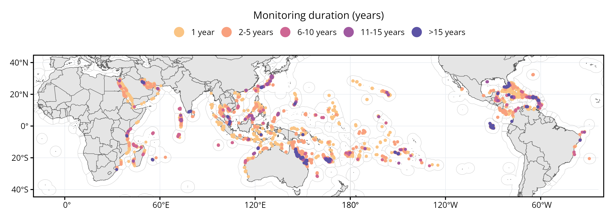

<!-- README.md is generated from README.Rmd. Please edit that file -->

# gcrmndb_benthos 

## Table of Contents

- [1. Introduction](#1-introduction)
  - [1.1 What is the GCRMN?](#11-what-is-the-gcrmn)
  - [1.2 Coral reef monitoring](#12-coral-reef-monitoring)
  - [1.3 Why this repository?](#13-why-this-repository)
  - [1.4 How to contribute?](#14-how-to-contribute)
- [2. Data integration](#2-data-integration)
  - [2.1 Definitions](#21-definitions)
  - [2.2 Workflow](#22-workflow)
- [3. Description of variables](#3-description-of-variables)
- [4. Quality checks](#4-quality-checks)
- [5. List of individual datasets](#5-list-of-individual-datasets)
- [6. Description of the synthetic
  dataset](#6-description-of-the-synthetic-dataset)
- [7. Sponsors](#7-sponsors)
- [8. References](#8-references)
- [9. Reproducibility parameters](#9-reproducibility-parameters)

## 1. Introduction

### 1.1 What is the GCRMN?

The [*Global Coral Reef Monitoring Network*](https://gcrmn.net/) (GCRMN)
is an operational network of the [*International Coral Reef
Initiative*](https://icriforum.org/) (ICRI) aiming to provide the best
available scientific information on the status and trends of coral reef
ecosystems for their conservation and management. The GCRMN is a global
network of scientists, managers and organisations that monitor the
condition of coral reefs throughout the world, operating through ten
regional nodes.

### 1.2 Coral reef monitoring

While coral reefs provide many ecosystem services to human populations
and host immense biodiversity, they are directly or indirectly
threatened by human activities. To understand what are the main drivers
of coral reefs’ resilience in the Anthropocene, and to appropriately
inform environmental policies that aim to protect these ecosystems, it
is necessary to have data describing how coral reef integrity is
changing over space and time.

Such data are acquired from ecological monitoring, which consist of
repetitive measurements of a specified set of ecological variables at
one or more locations over an extended period of time ([Vos *et al.*,
2000](https://link.springer.com/article/10.1023/A:1006139412372)). Coral
reef monitoring is usually assessed at local scale by different actors
(*e.g.* research institutes, governments, NGOs), using different data
standards (*i.e.* using different variable names and units). Hence, it
exist numerous heterogeneous datasets based on coral reef monitoring in
the world, which represent a major challenge to assess status and trends
of coral reefs at larger spatial scales.

### 1.3 Why this repository?

This repository aims to gather individual datasets on benthic cover that
have been acquired in the world’s coral reefs over the last decades and
to integrate them into a unique synthetic dataset. This dataset, named
`gcrmndb_benthos`, is used to produce GCRMN reports on status and trends
of coral reefs. In addition to its use for the production of GCRMN
reports, this dataset can possibly be used for macroecological analyses,
although this utilization is restricted to open access individual
datasets integrated. Finally, this repository constitutes an inventory
of existing data on benthic cover in coral reefs (see **Table 5**), and
represents a means to change the culture around data towards the FAIR
principles ([Wilkinson *et al.*,
2016](https://www.nature.com/articles/sdata201618)), and to preserve
these data for future generations.

**It is important to note that the `gcrmndb_benthos` is a code
repository, which consist of a hub to store the code used for data
integration, and not a data repository.**

### 1.4 How to contribute?

If you would like to contribute to this initiative by providing a
dataset on benthic cover monitoring data acquired in coral reefs, you
can contact Jérémy Wicquart.

Because the GCRMN is a network based on trust, we are very vigilant
regarding data authorship. **You will always remained the owner of the
dataset you share** within the `gcrmndb_benthos`. You can control the
use that will be made of your dataset by signing a data sharing
agreement. Any new use of your dataset made by the GCRMN will be the
object of a request sent by email. You are free to remove your dataset
from the `gcrmndb_benthos` at any time. Feel free to provide any
suggestions by email on the data integration process or unincluded
individual datasets.

## 2. Data integration

### 2.1 Definitions

**Table 1.** Definition of main terms used in this README.

| Term | Definition |
|---:|:---|
| Dataset | A collection of related sets of information that is composed of separate elements (data files) but can be manipulated as a unit by a computer. |
| Data aggregator | Data analyst responsible for the data integration process. |
| Data integration | Process of combining, merging, or joining data together, in order to make what were distinct, multiple data objects, into a single, unified data object ([Schildhauer, 2018](https://link.springer.com/chapter/10.1007/978-3-319-59928-1_8)). |
| Data provider | A person or an institution sharing a dataset for which they have been or are involved in the acquisition of the data contained in the dataset. |
| Data standardization | Process of converting the data format of a given dataset to a common data format (*i.e.* variables names and units). Data standardization is the preliminary step of data integration. |
| Synthetic dataset | A dataset resulting from the integration of multiple existing datasets ([Poisot *et al*., 2016](https://onlinelibrary.wiley.com/doi/10.1111/ecog.01941)). |

### 2.2 Workflow

**Figure 1.** Illustration of the data integration workflow used for the
creation of the `gcrmndb_benthos` synthetic dataset (see [Wicquart *et
al.*,
2022](https://www.sciencedirect.com/science/article/pii/S1574954121003344)).
*EEZ* = Economic Exclusive Zone, *NCBI* = National Center for
Biotechnology Information.

## 3. Description of variables

**Table 2.** Description of variables included in the `gcrmndb_benthos`
synthetic dataset. The icons for the variables categories (`Cat.`)
represents :memo: = description variables, :globe_with_meridians: =
spatial variables, :calendar: = temporal variables, :straight_ruler: =
methodological variables, :crab: = taxonomic variables,
:chart_with_upwards_trend: = metric variables. Variables names (except
*region*, *subregion*, *ecoregion*, *category*, *subcategory*, and
*condition*) correspond to [DarwinCore
terms](https://dwc.tdwg.org/terms).

| \# | Variable | Cat. | Type | Description |
|---:|:---|:--:|:---|:---|
| 1 | datasetID | :memo: | Factor | ID of the dataset |
| 2 | region | :globe_with_meridians: | Factor | GCRMN region (see [gcrmn_regions](https://github.com/JWicquart/gcrmn_regions)) |
| 3 | subregion | :globe_with_meridians: | Factor | GCRMN subregion (see [gcrmn_regions](https://github.com/JWicquart/gcrmn_regions)) |
| 4 | ecoregion | :globe_with_meridians: | Factor | Marine Ecoregion of the World (see [Spalding et al, 2007](https://doi.org/10.1641/B570707)) |
| 5 | country | :globe_with_meridians: | Factor | Country (obtained from [World EEZ v12](https://www.marineregions.org/downloads.php) (*SOVEREIGN1*)) |
| 6 | territory | :globe_with_meridians: | Character | Territory (obtained from [World EEZ v12](https://www.marineregions.org/downloads.php) (*TERRITORY1*)) |
| 7 | locality | :globe_with_meridians: | Character | Site name |
| 8 | habitat | :globe_with_meridians: | Factor | Habitat |
| 9 | parentEventID | :globe_with_meridians: | Integer | Transect ID |
| 10 | eventID | :globe_with_meridians: | Integer | Quadrat ID |
| 11 | decimalLatitude | :globe_with_meridians: | Numeric | Latitude (*decimal, EPSG:4326*) |
| 12 | decimalLongitude | :globe_with_meridians: | Numeric | Longitude (*decimal, EPSG:4326*) |
| 13 | verbatimDepth | :globe_with_meridians: | Numeric | Depth (*m*) |
| 14 | year | :calendar: | Integer | Four-digit year |
| 15 | month | :calendar: | Integer | Integer month |
| 16 | day | :calendar: | Integer | Integer day |
| 17 | eventDate | :calendar: | Date | Date (*YYYY-MM-DD*, ISO 8601) |
| 18 | samplingProtocol | :straight_ruler: | Character | Description of the method used to acquire the measurement |
| 19 | recordedBy | :straight_ruler: | Character | Name of the person who acquired the measurement |
| 20 | category | :crab: | Factor | Benthic category |
| 21 | subcategory | :crab: | Factor | Benthic subcategory |
| 22 | condition | :crab: | Character |  |
| 23 | phylum | :crab: | Character | Phylum |
| 24 | class | :crab: | Character | Class |
| 25 | order | :crab: | Character | Order |
| 26 | family | :crab: | Character | Family |
| 27 | genus | :crab: | Character | Genus |
| 28 | scientificName | :crab: | Character | Species |
| 29 | measurementValue | :chart_with_upwards_trend: | Numeric | Percentage cover |

**Table 3.** Description of levels for variables `category` and
`subcategory` (see **Table 2**).

|  category   | subcategory     | Description |
|:-----------:|:----------------|:------------|
|   Abiotic   | Rock            |             |
|             | Rubble          |             |
|             | Sand            |             |
|             | Silt            |             |
|    Algae    | Coralline algae |             |
|             | Cyanobacteria   |             |
|             | Macroalgae      |             |
|             | Turf algae      |             |
| Hard coral  |                 |             |
| Other fauna |                 |             |
|  Seagrass   |                 |             |

## 4. Quality checks

**Table 4.** List of quality checks used for the `gcrmndb_benthos`
synthetic dataset. Inspired by [Vandepitte *et al*,
2015](https://doi.org/10.1093/database/bau125). The icons for the
variables categories (`Cat.`) represents: :globe_with_meridians: =
spatial variables, :calendar: = temporal variables,
:chart_with_upwards_trend: = metric variables. EEZ = Economic Exclusive
Zone.

| \# | Cat. | Variables | Questions |
|:--:|:--:|----|:---|
| 1 | :globe_with_meridians: | `decimalLatitude` `decimalLongitude` | Are the latitude and longitude available? |
| 2 | :globe_with_meridians: | `decimalLatitude` | Is the latitude within its possible boundaries (*i.e.* between -90 and 90)? |
| 3 | :globe_with_meridians: | `decimalLongitude` | Is the longitude within its possible boundaries (*i.e.* between -180 and 180)? |
| 4 | :globe_with_meridians: | `decimalLatitude` `decimalLongitude` | Is the site within the coral reef distribution area (100 km buffer)? |
| 5 | :globe_with_meridians: | `decimalLatitude` `decimalLongitude` | Is the site located within a GCRMN region? |
| 6 | :globe_with_meridians: | `decimalLatitude` `decimalLongitude` | Is the site located within an EEZ (1 km buffer)? |
| 7 | :calendar: | `year` | Is the year available? |
| 8 | :chart_with_upwards_trend: | `measurementValue` | Is the sum of the percentage cover of benthic categories within the sampling unit greater than 0 and lower than 100? |
| 9 | :chart_with_upwards_trend: | `measurementValue` | Is the percentage cover of a given benthic category (*i.e.* a row) greater than 0 and lower than 100? |

## 5. List of individual datasets

**Table 5.** List of individual datasets integrated in the
`gcrmndb_benthos` synthetic dataset. The column *datasetID* is the
identifier of individual datasets integrated, *rightsHolder* is the
person or organization owning or managing rights over the resource,
*accessRights* is the indication of the security status of the resource,
*type* is the type of individual dataset storage and/or acquisition
(*Ar.* = article, *Db.* = database, *Me.* =
[MERMAID](https://dashboard.datamermaid.org/), *Pa.* = data paper, *Rc.*
= [ReefCloud](https://reefcloud.ai/dashboard/), *Rp.* = data repository,
*Sh.* = data sharing), *modified* is the date (YYYY-MM-DD) of the last
version of the individual dataset, *aggregator* is the name of the
person in charge of the data integration for the individual dataset
considered. The column names (except *aggregator*) correspond to
[DarwinCore terms](https://dwc.tdwg.org/terms).

| datasetID | rightsHolder | accessRights | type | modified | aggregator |
|:--:|:---|:---|:--:|:--:|:--:|
| 0001 | [USVI - Yawzi and Tektite](https://portal.edirepository.org/nis/mapbrowse?scope=edi&identifier=1091&revision=1) | open | Rp. | 2022-02-21 | JW |
| 0002 | [USVI - Random](https://portal.edirepository.org/nis/mapbrowse?scope=edi&identifier=1091&revision=1) | open | Rp. | 2022-02-21 | JW |
| 0003 | [AIMS](https://www.aims.gov.au/) | upon request | Sh. | 2024-12-04 | JW |
| 0004 | [CRIOBE - MPA](https://observatoire.criobe.pf/wiki/tiki-index.php?page=AMP+Moorea&structure=SO+CORAIL) | upon request | Sh. | 2022-09-08 | JW |
| 0005 | [CRIOBE - Polynesia Mana](https://observatoire.criobe.pf/wiki/tiki-index.php?page=Transect+corallien+par+photo-quadrat&structure=SO+CORAIL&latest=1) | upon request | Sh. | 2024-02-06 | JW |
| 0006 | [CRIOBE - Tiahura](https://observatoire.criobe.pf/wiki/tiki-index.php?page=Technique+d%27%C3%A9chantillonnage+Benthos+LTT&structure=SO+CORAIL&latest=1) | upon request | Sh. | 2022-12-31 | JW |
| 0007 | [CRIOBE - ATPP barrier reef](https://observatoire.criobe.pf/wiki/tiki-index.php?page=R%C3%A9cif+Barri%C3%A8re+ATPP&structure=SO+CORAIL&latest=1) | upon request | Sh. |  | JW |
| 0008 | [CRIOBE - ATPP outer slope](https://observatoire.criobe.pf/wiki/tiki-index.php?page=Pente+externe+ATPP&structure=SO+CORAIL&latest=1) | upon request | Sh. |  | JW |
| 0009 | [Seaview Survey](https://www.nature.com/articles/s41597-020-00698-6) | open | Pa. |  | JW |
| 0010 | [2013-2014_Koro Island, Fiji](https://dashboard.datamermaid.org/?project=2013-2014_Koro%20Island,%20Fiji) | open (summary) | Me. | 2021-06-08 | JW |
| 0011 | [NCRMP - American Samoa](https://www.ncei.noaa.gov/access/metadata/landing-page/bin/iso?id=gov.noaa.nodc:NCRMP-StRS-Images-AmSam) | open | Rp. | 2021-09-14 | JW |
| 0012 | [NCRMP - CNMI and Guam](https://www.ncei.noaa.gov/access/metadata/landing-page/bin/iso?id=gov.noaa.nodc:NCRMP-StRS-Images-Marianas) | open | Rp. | 2018-10-12 | JW |
| 0013 | [NCRMP - Hawaii](https://www.ncei.noaa.gov/access/metadata/landing-page/bin/iso?id=gov.noaa.nodc:NCRMP-StRS-Images-HI) | open | Rp. | 2022-11-11 | JW |
| 0014 | [NCRMP - PRIA](https://www.ncei.noaa.gov/access/metadata/landing-page/bin/iso?id=gov.noaa.nodc:NCRMP-StRS-Images-PRIA) | open | Rp. | 2021-07-30 | JW |
| 0015 | [Reef Check Foundation](https://www.reefcheck.org/tropical-program/tropical-monitoring-instruction/) | upon request | Db. | 2024-10-16 | JW |
| 0016 | Biosphere Foundation | upon request | Sh. |  | JW |
| 0017 | KNS | upon request | Sh. | 2022-12-27 | JW |
| 0018 | Kiribati | upon request | Sh. | 2020-03-05 | JW |
| 0019 | SLN | upon request | Sh. | 2022-05-12 | JW |
| 0020 | [PACN](https://www.nps.gov/im/pacn/benthic.htm) | upon request | Sh. |  | JW |
| 0021 | RORC NC | upon request | Sh. |  | JW |
| 0022 | [MCRMP](https://micronesiareefmonitoring.com/) | upon request | Sh. |  | JW |
| 0023 | PA-NC | upon request | Sh. |  | JW |
| 0024 | [Laurent WANTIEZ](https://scholar.google.fr/citations?user=4H_FTE0AAAAJ&hl=fr&oi=ao) | upon request | Sh. |  | JW |
| 0025 | [2011_Southern Bua](https://dashboard.datamermaid.org/?project=2011_Southern%20Bua) | open (summary) | Me. | 2021-09-08 | JW |
| 0026 | [2012_Western Bua](https://dashboard.datamermaid.org/?project=2012_Western%20Bua) | open (summary) | Me. | 2021-09-10 | JW |
| 0027 | [2009-2011_Kubulau](https://dashboard.datamermaid.org/?project=2009-2011_Kubulau) | open (summary) | Me. | 2021-09-08 | JW |
| 0028 | [C2O Pacific (a)](https://c2o.net.au/our-work-in-the-pacific/) | upon request | Rc. |  | JW |
| 0029 | Kimbe Bay | upon request | Sh. | 2019-09-11 | JW |
| 0030 | [PNG BAF 2019](https://dashboard.datamermaid.org/?project=PNG%20BAF%202019) | open (summary) | Me. | 2019-10-31 | JW |
| 0031 | [2017_Northern Lau](https://dashboard.datamermaid.org/?project=2017_Northern%20Lau) | open (summary) | Me. | 2021-02-08 | JW |
| 0032 | [2013-2014_Vatu-i-Ra](https://dashboard.datamermaid.org/?project=2013-2014_Vatu-i-Ra) | open (summary) | Me. | 2021-02-08 | JW |
| 0033 | [2019_Dama Bureta](https://dashboard.datamermaid.org/?project=2019_Dama%20Bureta%20Waibula%20and%20Dawasamu-WISH%20ecological%20survey) | open (summary) | Me. | 2020-08-12 | JW |
| 0034 | [2020_NamenaAndVatuira](https://dashboard.datamermaid.org/?project=2020_NamenaAndVatuira%20coral%20reef%20surveys) | open (summary) | Me. | 2020-10-12 | JW |
| 0035 | [Lau Seascape Surveys](https://dashboard.datamermaid.org/?project=Lau%20Seascape%20Surveys%20March%202022) | open (summary) | Me. | 2022-04-18 | JW |
| 0036 | SI_Munda | open (summary) | Rc. |  | JW |
| 0037 | [Khen et al, 2022](https://link.springer.com/article/10.1007/s00338-022-02271-6) | upon request | Sh. |  | JW |
| 0038 | [Reef Life Survey](https://doi.org/10.1016/j.biocon.2020.108855) | upon request | Sh. | 2023-09-13 | JW |
| 0039 | [MMR](https://www.mmr.gov.ck/) | upon request | Sh. | 2023-09-12 | JW |
| 0040 | [Smallhorn-West et al, 2019](https://doi.pangaea.de/10.1594/PANGAEA.904800) | open | Rp. | 2019-08-15 | JW |
| 0041 | Hydro-Paalo | upon request | Sh. | 2022-12-16 | JW |
| 0042 | [Living Ocean Foundation](https://www.livingoceansfoundation.org/) | upon request | Sh. |  | JW |
| 0043 | [100 Island Challenge](https://sandinlab.ucsd.edu/100-island-challenge/) | upon request | Sh. | 2023-11-06 | JW |
| 0044 | [PICRC](https://picrc.org/work/coral/) | upon request | Sh. |  | JW |
| 0045 | [SRMR and Combe Reef](https://dashboard.datamermaid.org/?project=SRMR%20and%20Combe%20reef%20comparison) | open (summary) | Me. | 2024-01-09 | JW |
| 0046 | [2023-24 Fiji GCRMN sites](https://dashboard.datamermaid.org/?project=2023-24%20Fiji%20GCRMN%20sites) | open (summary) | Me. | 2024-01-09 | JW |
| 0047 | Kayal and Dromard | upon request | Sh. |  | JW |
| 0048 | Kayal, Penin, and Adjeroud (NC) | upon request | Sh. |  | JW |
| 0049 | Kayal, Penin, and Adjeroud (Mo.) | upon request | Sh. |  | JW |
| 0050 | FEO | upon request | Sh. | 2020-02-12 | JW |
| 0051 | Phoenix Islands | upon request | Sh. |  | JW |
| 0052 | [Vava’u Ocean Initiative 2017](https://vavauenvironment.org/portfolio/vavau-ocean-initiative/) | upon request | Sh. |  | JW |
| 0053 | [Vava’u Ocean Initiative 2022](https://vavauenvironment.org/portfolio/vavau-ocean-initiative/) | upon request | Sh. |  | JW |
| 0054 | [100 Island Challenge (SLI)](https://sandinlab.ucsd.edu/100-island-challenge/) | upon request | Sh. |  | JW |
| 0055 | [Samoa Ocean Strategy](https://www.samoaocean.org/) | upon request | Sh. |  | JW |
| 0056 | [SBN_UAE_2023](https://dashboard.datamermaid.org/?project=SBN_UAE_2023) | open (summary) | Me. |  | JW |
| 0057 | [Kuwait_2010](https://dashboard.datamermaid.org/?project=Kuwait_2010) | open (summary) | Me. |  | JW |
| 0058 | [Kuwait_2014](https://dashboard.datamermaid.org/?project=Kuwait_2014) | open (summary) | Me. |  | JW |
| 0059 | [Bahrain_2011](https://dashboard.datamermaid.org/?project=Bahrain_2011) | open (summary) | Me. |  | JW |
| 0060 | [Ankay Conservation](https://ankayconservation.com) | upon request | Sh. | 2024-07-08 | JW |
| 0061 | [C2O Pacific (b)](https://c2o.net.au/our-work-in-the-pacific/) | upon request | Sh. | 2024-07-09 | JW |
| 0062 | [Reef Renewal Bonaire](https://www.reefrenewalbonaire.org/) | upon request | Sh. | 2024-07-16 | JW |
| 0063 | [Qatar_2015-2017](https://dashboard.datamermaid.org/?project=Qatar_2015-2017) | open (summary) | Me. | 2024-07-24 | JW |
| 0064 | [UAE_Musandam](https://dashboard.datamermaid.org/?project=UAE_Musandam_Multiproject_2019-2020) | open (summary) | Me. | 2024-07-24 | JW |
| 0065 | [SBNvsKF_UAE_2021-2022](https://dashboard.datamermaid.org/?project=SBNvsKF_UAE_2021-2022) | open (summary) | Me. | 2024-07-25 | JW |
| 0066 | [Nature Foundation SXM](https://naturefoundationsxm.org/) | upon request | Sh. | 2024-07-25 | JW |
| 0067 | [ODE Martinique](https://www.eaumartinique.fr/oe-accueil) | upon request | Sh. | 2024-07-31 | JW |
| 0068 | [AlHiel_UAE_2023](https://dashboard.datamermaid.org/?project=AlHiel_UAE_2023) | open (summary) | Me. | 2024-07-25 | JW |
| 0069 | [UAE_Musandam_2022](https://dashboard.datamermaid.org/?project=UAE_Musandam_2022) | open (summary) | Me. | 2024-08-02 | JW |
| 0070 | Claereboudt, 2015 | upon request | Sh. | 2024-08-25 | JW |
| 0071 | Aeby et al, 2022 | upon request | Sh. | 2024-08-25 | JW |
| 0072 | Al Mealla, 2022 | upon request | Sh. | 2024-08-26 | JW |
| 0073 | [Howells et al, 2020](https://doi.org/10.1007/s00338-020-01946-2) | upon request | Sh. | 2024-08-26 | JW |
| 0074 | Shokri, 2021 | upon request | Sh. | 2024-08-26 | JW |
| 0075 | [Aeby et al, 2020](https://doi.org/10.1007/s00338-020-01928-4) | upon request | Sh. | 2024-08-25 | JW |
| 0076 | [KFUPM - Saudi Aramco](https://kfupm.edu.sa/) | upon request | Sh. | 2024-09-11 | JW |
| 0077 | [Sulubaaï (Shark Fin Bay project)](https://dashboard.datamermaid.org/?project=Shark%20Fin%20Bay%20Project) | open (summary) | Me. | 2024-09-13 | JW |
| 0078 | [Puntacana Foundation](https://puntacana.org/) | upon request | Sh. | 2024-09-17 | JW |
| 0079 | [TCRMP](https://www.vitcrmp.org/) | upon request | Sh. | 2024-09-19 | JW |
| 0080 | [FUNDEMAR](https://www.fundemardr.org/) | upon request | Sh. | 2024-09-23 | JW |
| 0081 | UWI DBML | upon request | Sh. | 2024-09-24 | JW |
| 0082 | Saba | upon request | Sh. | 2024-09-30 | JW |
| 0083 | [RNSM](https://reservenaturelle-saint-martin.com/) | upon request | Sh. | 2024-10-06 | JW |
| 0084 | [Curacao](https://www.researchstationcarmabi.org/) | upon request | Sh. | 2024-10-10 | JW |
| 0085 | [BREAM](https://www.bermudabream.com/) | upon request | Sh. | 2024-10-10 | JW |
| 0086 | [Fundacion Cap Cana](https://www.fundacioncapcana.org/) | upon request | Sh. | 2024-10-10 | JW |
| 0087 | Titè - ONF | upon request | Sh. | 2024-10-10 | JW |
| 0088 | Grand Cayman | upon request | Sh. | 2024-10-11 | JW |
| 0089 | [Coral Cay Conservation](https://www.coralcay.org/) | upon request | Sh. | 2024-10-14 | JW |
| 0090 | [Montilla et al, 2021](https://doi.org/10.1016/j.dib.2021.107235) | open | Pa. | 2024-10-15 | JW |
| 0091 | [AGRRA](https://www.agrra.org/) | upon request | Db. | 2024-10-17 | JW |
| 0092 | CZMU | upon request | Sh. | 2024-10-18 | JW |
| 0093 | [Puerto Rico CRMP](https://www.ncei.noaa.gov/access/metadata/landing-page/bin/iso?id=gov.noaa.nodc:0204647) | open | Rp. | 2024-10-18 | JW |
| 0094 | CECIMAR | upon request | Sh. | 2024-10-21 | JW |
| 0095 | CIMAR - UCR | upon request | Sh. | 2024-10-22 | JW |
| 0096 | Bouchon and Bouchon | upon request | Sh. | 2024-10-28 | JW |
| 0097 | [SECREMP](https://www.ncei.noaa.gov/access/metadata/landing-page/bin/iso?id=gov.noaa.nodc:0280596) | open | Rp. | 2024-10-28 | JW |
| 0098 | Steneck | upon request | Sh. | 2024-10-28 | JW |
| 0099 | Meesters et al. | upon request | Sh. | 2024-10-30 | JW |
| 0100 | [Abu Dhabi 2017-2019](https://dashboard.datamermaid.org/?project=Abu%20Dhabi%202017-2019) | open (summary) | Me. | 2024-10-31 | JW |
| 0101 | [NCRMP - FGB](https://doi.org/10.7289/v5vd6wts) | open | Rp. | 2024-11-04 | JW |
| 0102 | [NCRMP - Puerto Rico](https://doi.org/10.7289/v5pg1q23) | open | Rp. | 2024-11-04 | JW |
| 0103 | [NCRMP - USVI](https://doi.org/10.7289/v5ww7fqk) | open | Rp. | 2024-11-04 | JW |
| 0104 | [NCRMP - Florida](https://doi.org/10.7289/v5xw4h4z) | open | Rp. | 2024-11-04 | JW |
| 0105 | [UAE_Oman_2008-2012](https://dashboard.datamermaid.org/?project=UAE_Oman_2008-2012) | open (summary) | Me. | 2024-11-04 | JW |
| 0106 | [DTCREMP](https://geodata.myfwc.com/documents/797abdd95d4146e1b7546d7df6a1ecf5/about) | open | Rp. | 2024-11-05 | JW |
| 0107 | [CREMP](https://geodata.myfwc.com/documents/2ab2e706c83d4247855f8e4e689c7cba/about) | open | Rp. | 2024-11-05 | JW |
| 0108 | WLC | upon request | Sh. | 2024-11-06 | JW |
| 0109 | Kemenes-Varadero | upon request | Sh. | 2024-11-07 | JW |
| 0110 | [INVEMAR](https://www.invemar.org.co/) | upon request | Sh. | 2024-11-09 | JW |
| 0111 | [NEPA](https://www.nepa.gov.jm/) | upon request | Sh. | 2024-11-12 | JW |
| 0112 | [DBCA](https://www.dbca.wa.gov.au/) | upon request | Sh. | 2024-11-25 | JW |
| 0113 | [Barcolab](https://www.barcolab.org/) | upon request | Sh. | 2024-11-25 | JW |
| 0114 | [STENAPA](https://statiapark.org/) | upon request | Sh. | 2024-11-28 | JW |
| 0115 | [CCMI](https://reefresearch.org/) | upon request | Sh. | 2024-11-29 | JW |
| 0116 | [SFS](https://fieldstudies.org/center/tci/) | upon request | Sh. | 2024-12-02 | JW |
| 0117 | González Díaz et al. | upon request | Sh. | 2024-12-02 | JW |
| 0118 | [Tebbett et al, 2022](https://doi.org/10.1016/j.marenvres.2021.105537) | upon request | Sh. | 2024-12-05 | JW |
| 0119 | [UAE_2019_Mateos](https://dashboard.datamermaid.org/?project=UAE_2019_Mateos) | upon request | Me. | 2024-12-05 | JW |
| 0120 | [Oman_2017_2020](https://dashboard.datamermaid.org/?project=Oman_2017_2020) | upon request | Me. | 2024-12-05 | JW |
| 0121 | [CORDIO (Kenya)](https://cordioea.net/) | upon request | Sh. | 2024-12-06 | JW |
| 0122 | [A Rocha Kenya](https://www.arocha.or.ke/) | upon request | Sh. | 2024-12-06 | JW |
| 0123 | [REEFolution](https://reefolution.org/) | upon request | Sh. | 2024-12-06 | JW |
| 0124 | [KMFRI](https://kmfri.go.ke/) | upon request | Sh. | 2024-12-06 | JW |
| 0125 | [WRTI](https://wrti.go.ke/) | upon request | Sh. | 2024-12-06 | JW |
| 0126 | [Dahari](https://daharicomores.org/) | upon request | Sh. | 2024-12-06 | JW |
| 0127 | Moheli MPA | upon request | Sh. | 2024-12-06 | JW |
| 0128 | [AIDE](https://www.aide-comores.org/) | upon request | Sh. | 2024-12-06 | JW |
| 0129 | [CORDIO (Comoros)](https://cordioea.net/) | upon request | Sh. | 2024-12-06 | JW |
| 0130 | Alemu I | upon request | Sh. | 2024-12-09 | JW |
| 0131 | [Maldives Resilient Reefs](https://www.maldivesresilientreefs.com/) | upon request | Sh. | 2024-12-09 | JW |
| 0132 | [Maldives Resilient Reefs (RC)](https://www.maldivesresilientreefs.com/) | upon request | Rc. | 2024-12-10 | JW |
| 0133 | [Wilkinson et al, 2013](https://doi.org/10.1016/j.marpolbul.2013.02.040) | upon request | Sh. | 2024-12-12 | JW |
| 0134 | Kimberley Marine Parks | upon request | Sh. | 2024-12-13 | JW |
| 0135 | Garza et al, 2022 | upon request | Sh. | 2024-12-14 | JW |
| 0136 | Coral Sea Marine Park | upon request | Sh. | 2024-12-17 | JW |
| 0137 | [Qatar_2014](https://dashboard.datamermaid.org/?project=Qatar_2014) | upon request | Me. | 2024-12-18 | JW |
| 0138 | Hawkins and Roberts, 1995 | upon request | Sh. | 2024-12-18 | JW |
| 0139 | Raghunathan and Mondal | upon request | Sh. | 2025-01-02 | JW |
| 0140 | Fairoz | upon request | Sh. | 2025-01-02 | JW |
| 0141 | SDMRI | upon request | Sh. | 2025-01-09 | JW |
| 0142 | [Benkwitt et al. (a)](https://www.science.org/doi/10.1126/sciadv.adj0390) | upon request | Sh. | 2025-01-12 | JW |
| 0143 | Benkwitt et al. (b) | upon request | Sh. | 2025-01-12 | JW |
| 0144 | [UAE_2006-2014](https://dashboard.datamermaid.org/?project=UAE_2006-2014) | upon request | Me. | 2025-01-16 | JW |

## 6. Description of the synthetic dataset

On the 2025-01-16, the `gcrmndb_benthos` synthetic dataset contains a
total of **20,894,970 observations** (*i.e* rows) representing **23,877
sites** and **51,701 surveys**. The distribution of monitoring sites in
time and space is shown in **Figure 2**. An interactive version of this
map is available on [Google Earth
Engine](https://jeremywicquart.users.earthengine.app/view/gcrmndbbenthos).

**Figure 2.** Map of the distribution of benthic cover monitoring sites
for which data are included within the `gcrmndb_benthos` synthetic
dataset. Light grey polygons represents economic exclusive zones.
Colours corresponds to monitoring duration which is the difference, for
each site, between the first and last years with data. Note that the
datasetID 0009 is not included in this map, due to the very large number
of sites and a monitoring method that differs from those of the other
datasets.

**Table 6.** Summary of the content of the `gcrmndb_benthos` synthetic
dataset per GCRMN region. EAS = East Asian Seas, ETP = Eastern Tropical
Pacific, WIO = Western Indian Ocean. The total number of datasets
integrated within the `gcrmndb_benthos` can differ from the sum of the
column `Datasets (n)`, as some datasets includes sites in different
GCRMN regions. Note that the datasetID 0009 is not included in this
table, due to the very large number of sites and a monitoring method
that differs from those of the other datasets.

|         GCRMN region | Sites (n) | Surveys (n) | Datasets (n) | First year | Last year |
|---------------------:|----------:|------------:|-------------:|:----------:|:---------:|
|            Australia |     1,618 |       8,229 |            7 |    1980    |   2024    |
|               Brazil |       138 |         189 |            2 |    2002    |   2012    |
|            Caribbean |     9,794 |      17,901 |           49 |    1973    |   2024    |
|                  EAS |     3,039 |       6,711 |            6 |    1997    |   2024    |
|                  ETP |       257 |         313 |            2 |    1998    |   2018    |
|               PERSGA |       251 |         570 |            2 |    1997    |   2024    |
|              Pacific |     7,849 |      14,745 |           52 |    1987    |   2024    |
|                ROPME |       310 |         629 |           23 |    1997    |   2024    |
|           South Asia |       314 |       1,849 |            8 |    1997    |   2024    |
|                  WIO |       307 |         565 |           11 |    1997    |   2024    |
| Global (all regions) |    23,877 |      51,701 |          142 |    1973    |   2024    |

**Table 7.** Summary of the content of the `gcrmndb_benthos` synthetic
dataset per country and territory. The total number of datasets
integrated within the `gcrmndb_benthos` can differ from the sum of the
column `Datasets (n)`, as some datasets includes sites in different
territories. Note that the datasetID 0009 is not included in this table,
due to the very large number of sites and a monitoring method that
differs from those of the other datasets.

| Country | Territory | Sites (n) | Surveys (n) | Datasets (n) | First year | Last year |
|---:|:---|---:|---:|---:|:--:|:--:|
| Antigua and Barbuda | Antigua and Barbuda | 41 | 50 | 2 | 2003 | 2022 |
| Australia | Australia | 1,597 | 8,172 | 7 | 1980 | 2024 |
| Australia | Christmas Island | 16 | 30 | 2 | 2003 | 2010 |
| Australia | Cocos Islands | 20 | 49 | 1 | 1997 | 2008 |
| Bahamas | Bahamas | 543 | 813 | 3 | 1986 | 2024 |
| Bahrain | Bahrain | 23 | 33 | 3 | 1997 | 2022 |
| Bangladesh | Bangladesh | 2 | 2 | 1 | 2005 | 2006 |
| Barbados | Barbados | 80 | 349 | 3 | 1982 | 2022 |
| Belize | Belize | 472 | 760 | 4 | 1985 | 2024 |
| Brazil | Brazil | 138 | 189 | 2 | 2002 | 2012 |
| Brunei | Brunei | 38 | 45 | 1 | 1997 | 2016 |
| Cambodia | Cambodia | 98 | 105 | 2 | 1998 | 2013 |
| China | China | 100 | 366 | 1 | 1997 | 2012 |
| Colombia | Colombia | 188 | 403 | 5 | 1997 | 2024 |
| Comores | Comores | 50 | 104 | 4 | 2017 | 2024 |
| Costa Rica | Costa Rica | 88 | 119 | 4 | 1999 | 2023 |
| Cuba | Cuba | 196 | 205 | 3 | 1999 | 2023 |
| Djibouti | Djibouti | 23 | 23 | 1 | 2005 | 2008 |
| Dominica | Dominica | 31 | 46 | 2 | 2004 | 2018 |
| Dominican Republic | Dominican Republic | 402 | 636 | 5 | 1999 | 2024 |
| East Timor | East Timor | 11 | 13 | 2 | 2004 | 2017 |
| Ecuador | Galapagos | 69 | 69 | 1 | 2008 | 2012 |
| Egypt | Egypt | 182 | 491 | 2 | 1997 | 2024 |
| Eritrea | Eritrea | 2 | 2 | 1 | 2000 | 2000 |
| Federal Republic of Somalia | Federal Republic of Somalia | 1 | 1 | 1 | 2005 | 2005 |
| Fiji | Fiji | 654 | 1,001 | 12 | 1997 | 2024 |
| France | Collectivity of Saint Martin | 12 | 83 | 2 | 2007 | 2022 |
| France | Europa Island | 1 | 1 | 1 | 2002 | 2002 |
| France | French Polynesia | 229 | 2,191 | 8 | 1987 | 2024 |
| France | Guadeloupe | 27 | 191 | 4 | 2002 | 2023 |
| France | Martinique | 22 | 41 | 2 | 2003 | 2024 |
| France | Mayotte | 20 | 87 | 1 | 2003 | 2017 |
| France | New Caledonia | 873 | 3,616 | 9 | 1997 | 2023 |
| France | Réunion | 32 | 133 | 1 | 2003 | 2016 |
| France | Saint-Barthélemy | 4 | 41 | 2 | 2002 | 2020 |
| France | Wallis and Futuna | 12 | 12 | 1 | 2019 | 2019 |
| Grenada | Grenada | 99 | 239 | 3 | 2004 | 2024 |
| Guatemala | Guatemala | 24 | 49 | 2 | 2006 | 2023 |
| Haiti | Haiti | 96 | 109 | 2 | 2003 | 2018 |
| Haiti | Navassa Island | 15 | 15 | 1 | 2012 | 2012 |
| Honduras | Honduras | 390 | 738 | 2 | 1997 | 2024 |
| India | Andaman and Nicobar | 29 | 29 | 1 | 2021 | 2022 |
| India | India | 85 | 1,473 | 2 | 1998 | 2023 |
| Indonesia | Indonesia | 676 | 1,123 | 2 | 1997 | 2024 |
| Iran | Iran | 45 | 70 | 2 | 1999 | 2021 |
| Israel | Israel | 4 | 4 | 1 | 1997 | 2001 |
| Jamaica | Jamaica | 303 | 785 | 5 | 1986 | 2023 |
| Japan | Japan | 52 | 110 | 2 | 1997 | 2015 |
| Jordan | Jordan | 3 | 3 | 1 | 2008 | 2008 |
| Kenya | Kenya | 92 | 99 | 6 | 2003 | 2023 |
| Kiribati | Gilbert Islands | 18 | 18 | 2 | 2011 | 2018 |
| Kiribati | Line Group | 97 | 125 | 3 | 2009 | 2023 |
| Kiribati | Phoenix Group | 58 | 123 | 1 | 2009 | 2018 |
| Kuwait | Kuwait | 13 | 23 | 3 | 2006 | 2014 |
| Madagascar | Madagascar | 43 | 55 | 1 | 2001 | 2019 |
| Malaysia | Malaysia | 736 | 2,956 | 2 | 1997 | 2023 |
| Maldives | Maldives | 192 | 284 | 4 | 1997 | 2024 |
| Marshall Islands | Marshall Islands | 147 | 174 | 3 | 2002 | 2020 |
| Mexico | Mexico | 503 | 1,075 | 5 | 1997 | 2024 |
| Micronesia | Federated States of Micronesia | 217 | 555 | 3 | 2000 | 2020 |
| Mozambique | Mozambique | 17 | 19 | 2 | 1997 | 2024 |
| Myanmar | Myanmar | 22 | 29 | 1 | 2001 | 2013 |
| Netherlands | Aruba | 6 | 7 | 1 | 2003 | 2009 |
| Netherlands | Bonaire | 154 | 618 | 6 | 1973 | 2023 |
| Netherlands | Curaçao | 151 | 444 | 4 | 1973 | 2023 |
| Netherlands | Saba | 30 | 68 | 3 | 1994 | 2024 |
| Netherlands | Sint-Eustatius | 37 | 72 | 3 | 1999 | 2023 |
| Netherlands | Sint-Maarten | 14 | 61 | 3 | 1999 | 2024 |
| New Zealand | Cook Islands | 191 | 246 | 5 | 2005 | 2023 |
| New Zealand | Niue | 7 | 7 | 1 | 2011 | 2011 |
| Nicaragua | Nicaragua | 37 | 37 | 2 | 2003 | 2015 |
| Oman | Oman | 123 | 266 | 8 | 2003 | 2022 |
| Palau | Palau | 112 | 381 | 3 | 1997 | 2022 |
| Panama | Panama | 194 | 320 | 4 | 1997 | 2024 |
| Papua New Guinea | Papua New Guinea | 91 | 267 | 4 | 1998 | 2019 |
| Philippines | Philippines | 842 | 1,136 | 3 | 1997 | 2023 |
| Qatar | Qatar | 19 | 19 | 2 | 2014 | 2017 |
| Republic of Mauritius | Chagos Archipelago | 25 | 71 | 2 | 2010 | 2023 |
| Republic of Mauritius | Republic of Mauritius | 10 | 12 | 1 | 1999 | 2003 |
| Saint Kitts and Nevis | Saint Kitts and Nevis | 38 | 55 | 2 | 2004 | 2024 |
| Saint Lucia | Saint Lucia | 21 | 61 | 1 | 1999 | 2014 |
| Saint Vincent and the Grenadines | Saint Vincent and the Grenadines | 45 | 63 | 2 | 1999 | 2024 |
| Samoa | Samoa | 50 | 90 | 4 | 2012 | 2022 |
| Saudi Arabia | Saudi Arabia | 27 | 42 | 2 | 1997 | 2024 |
| Seychelles | Seychelles | 19 | 19 | 2 | 1997 | 2012 |
| Solomon Islands | Solomon Islands | 147 | 245 | 5 | 2005 | 2021 |
| South Africa | South Africa | 5 | 6 | 1 | 2001 | 2005 |
| Sri Lanka | Sri Lanka | 10 | 19 | 2 | 2003 | 2023 |
| Sudan | Sudan | 11 | 14 | 1 | 2004 | 2009 |
| Taiwan | Taiwan | 103 | 195 | 1 | 1997 | 2020 |
| Tanzania | Tanzania | 18 | 30 | 2 | 1997 | 2012 |
| Thailand | Thailand | 150 | 248 | 1 | 1998 | 2024 |
| Tonga | Tonga | 529 | 575 | 7 | 2002 | 2022 |
| Trinidad and Tobago | Trinidad and Tobago | 41 | 104 | 2 | 2007 | 2023 |
| United Arab Emirates | Abu musa, Greater and Lesser Tunb | 7 | 7 | 1 | 2016 | 2017 |
| United Arab Emirates | United Arab Emirates | 73 | 196 | 12 | 2004 | 2024 |
| United Kingdom | Anguilla | 1 | 1 | 1 | 2002 | 2002 |
| United Kingdom | Bermuda | 40 | 88 | 1 | 2015 | 2021 |
| United Kingdom | British Virgin Islands | 26 | 72 | 2 | 1997 | 2012 |
| United Kingdom | Cayman Islands | 57 | 164 | 4 | 1997 | 2024 |
| United Kingdom | Montserrat | 87 | 109 | 2 | 2005 | 2017 |
| United Kingdom | Pitcairn | 6 | 12 | 2 | 2009 | 2023 |
| United Kingdom | Turks and Caicos Islands | 77 | 134 | 4 | 1999 | 2023 |
| United States | American Samoa | 844 | 904 | 4 | 1997 | 2019 |
| United States | Guam | 305 | 357 | 4 | 1997 | 2021 |
| United States | Hawaii | 1,734 | 1,924 | 4 | 1997 | 2021 |
| United States | Howland and Baker Islands | 150 | 150 | 1 | 2015 | 2017 |
| United States | Jarvis Island | 222 | 222 | 1 | 2015 | 2017 |
| United States | Johnston Atoll | 46 | 46 | 1 | 2015 | 2015 |
| United States | Northern Mariana Islands | 680 | 924 | 3 | 1999 | 2020 |
| United States | Palmyra Atoll | 194 | 298 | 2 | 2009 | 2019 |
| United States | Puerto Rico | 1,055 | 1,353 | 6 | 1986 | 2024 |
| United States | United States | 1,734 | 3,985 | 9 | 1986 | 2024 |
| United States | United States Virgin Islands | 2,551 | 3,525 | 7 | 1986 | 2024 |
| United States | Wake Island | 146 | 146 | 1 | 2014 | 2017 |
| Vanuatu | Vanuatu | 75 | 114 | 3 | 2004 | 2023 |
| Venezuela | Venezuela | 50 | 57 | 3 | 1999 | 2018 |
| Vietnam | Vietnam | 182 | 356 | 1 | 1998 | 2011 |
| Yemen | Yemen | 5 | 5 | 1 | 2008 | 2008 |

## 7. Sponsors

The following organizations have funded the realization of the
`gcrmndb_benthos` synthetic dataset:

- The Prince Albert II of Monaco Foundation
- French Ministry of Ecological Transition

## 8. References

- Poisot, T., Gravel, D., Leroux, S., Wood, S. A., Fortin, M. J.,
  Baiser, B., … & Stouffer, D. B. (**2016**). [Synthetic datasets and
  community tools for the rapid testing of ecological
  hypotheses](https://onlinelibrary.wiley.com/doi/10.1111/ecog.01941).
  *Ecography*, 39(4), 402-408.

- Schildhauer, M. (**2018**). [Data integration: Principles and
  practice](https://link.springer.com/chapter/10.1007/978-3-319-59928-1_8).
  In: Recknagel, F., Michener, W.K. (Eds.), *Ecological Informatics*.
  Springer, pp. 129–157.

- Spalding, M. D., Fox, H. E., Allen, G. R., Davidson, N., Ferdaña, Z.
  A., Finlayson, M. A. X., \[…\] & Robertson, J. (**2007**). [Marine
  ecoregions of the world: a bioregionalization of coastal and shelf
  areas](https://doi.org/10.1641/B570707). *BioScience*, 57(7), 573-583.

- Vandepitte, L., Bosch, S., Tyberghein, L., Waumans, F., Vanhoorne, B.,
  Hernandez, F., \[…\] and Mees, J. (**2015**). [Fishing for data and
  sorting the catch: assessing the data quality, completeness and
  fitness for use of data in marine biogeographic
  databases](https://doi.org/10.1093/database/bau125). *Database*.

- Vos, P., E. Meelis, and W. J. Ter Keurs (**2000**). [A Framework for
  the Design of Ecological Monitoring Programs as a Tool for
  Environmental and Nature
  Management](https://link.springer.com/article/10.1023/A:1006139412372).
  Environmental Monitoring and Assessment\* 61(3): 317–44.

- Wicquart, J., Gudka, M., Obura, D., Logan, M., Staub, F., Souter, D.,
  & Planes, S. (**2022**). [A workflow to integrate ecological
  monitoring data from different
  sources](https://www.sciencedirect.com/science/article/pii/S1574954121003344).
  *Ecological Informatics*, 68, 101543.

- Wieczorek J, Bloom D, Guralnick R, Blum S, Döring M, et
  al. (**2012**). [Darwin Core: An Evolving Community-Developed
  Biodiversity Data
  Standard](https://doi.org/10.1371/journal.pone.0029715). *PLoS ONE*
  7(1): e29715.

- Wilkinson, M. D., Dumontier, M., Aalbersberg, I. J., Appleton, G.,
  Axton, M., Baak, A., … & Mons, B. (**2016**). [The FAIR Guiding
  Principles for scientific data management and
  stewardship](https://www.nature.com/articles/sdata201618). *Scientific
  data*, 3(1), 1-9.

## 9. Reproducibility parameters

    ─ Session info ───────────────────────────────────────────────────────────────
     setting  value
     version  R version 4.4.2 (2024-10-31 ucrt)
     os       Windows 11 x64 (build 22631)
     system   x86_64, mingw32
     ui       RTerm
     language (EN)
     collate  French_France.utf8
     ctype    French_France.utf8
     tz       Europe/Paris
     date     2025-01-16
     pandoc   3.2 @ C:/Program Files/RStudio/resources/app/bin/quarto/bin/tools/ (via rmarkdown)

    ─ Packages ───────────────────────────────────────────────────────────────────
     package           * version  date (UTC) lib source
     askpass             1.2.1    2024-10-04 [1] CRAN (R 4.4.1)
     backports           1.5.0    2024-05-23 [1] CRAN (R 4.4.0)
     base64enc           0.1-3    2015-07-28 [1] CRAN (R 4.4.0)
     bit                 4.5.0.1  2024-12-03 [1] CRAN (R 4.4.2)
     bit64               4.5.2    2024-09-22 [1] CRAN (R 4.4.1)
     blob                1.2.4    2023-03-17 [1] CRAN (R 4.4.1)
     broom               1.0.7    2024-09-26 [1] CRAN (R 4.4.1)
     bslib               0.8.0    2024-07-29 [1] CRAN (R 4.4.1)
     cachem              1.1.0    2024-05-16 [1] CRAN (R 4.4.1)
     callr               3.7.6    2024-03-25 [1] CRAN (R 4.4.1)
     cellranger          1.1.0    2016-07-27 [1] CRAN (R 4.4.1)
     class               7.3-22   2023-05-03 [1] CRAN (R 4.4.2)
     classInt            0.4-10   2023-09-05 [1] CRAN (R 4.4.1)
     cli                 3.6.3    2024-06-21 [1] CRAN (R 4.4.1)
     clipr               0.8.0    2022-02-22 [1] CRAN (R 4.4.1)
     colorspace          2.1-1    2024-07-26 [1] CRAN (R 4.4.1)
     conflicted          1.2.0    2023-02-01 [1] CRAN (R 4.4.1)
     cpp11               0.5.1    2024-12-04 [1] CRAN (R 4.4.2)
     crayon              1.5.3    2024-06-20 [1] CRAN (R 4.4.1)
     credentials         2.0.2    2024-10-04 [1] CRAN (R 4.4.2)
     crosstalk           1.2.1    2023-11-23 [1] CRAN (R 4.4.2)
     curl                6.0.1    2024-11-14 [1] CRAN (R 4.4.2)
     data.table          1.16.4   2024-12-06 [1] CRAN (R 4.4.2)
     DBI                 1.2.3    2024-06-02 [1] CRAN (R 4.4.1)
     dbplyr              2.5.0    2024-03-19 [1] CRAN (R 4.4.1)
     desc                1.4.3    2023-12-10 [1] CRAN (R 4.4.2)
     digest              0.6.37   2024-08-19 [1] CRAN (R 4.4.1)
     dplyr             * 1.1.4    2023-11-17 [1] CRAN (R 4.4.1)
     DT                  0.33     2024-04-04 [1] CRAN (R 4.4.2)
     dtplyr              1.3.1    2023-03-22 [1] CRAN (R 4.4.1)
     e1071               1.7-16   2024-09-16 [1] CRAN (R 4.4.1)
     evaluate            1.0.1    2024-10-10 [1] CRAN (R 4.4.1)
     fansi               1.0.6    2023-12-08 [1] CRAN (R 4.4.1)
     farver              2.1.2    2024-05-13 [1] CRAN (R 4.4.1)
     fastmap             1.2.0    2024-05-15 [1] CRAN (R 4.4.1)
     fontawesome         0.5.3    2024-11-16 [1] CRAN (R 4.4.2)
     forcats           * 1.0.0    2023-01-29 [1] CRAN (R 4.4.1)
     formattable         0.2.1    2021-01-07 [1] CRAN (R 4.4.2)
     fs                  1.6.5    2024-10-30 [1] CRAN (R 4.4.1)
     gargle              1.5.2    2023-07-20 [1] CRAN (R 4.4.1)
     generics            0.1.3    2022-07-05 [1] CRAN (R 4.4.1)
     gert                2.1.4    2024-10-14 [1] CRAN (R 4.4.2)
     ggplot2           * 3.5.1    2024-04-23 [1] CRAN (R 4.4.1)
     gh                  1.4.1    2024-03-28 [1] CRAN (R 4.4.2)
     gitcreds            0.1.2    2022-09-08 [1] CRAN (R 4.4.2)
     glue                1.8.0    2024-09-30 [1] CRAN (R 4.4.1)
     googledrive         2.1.1    2023-06-11 [1] CRAN (R 4.4.1)
     googlesheets4       1.1.1    2023-06-11 [1] CRAN (R 4.4.1)
     gtable              0.3.6    2024-10-25 [1] CRAN (R 4.4.1)
     haven               2.5.4    2023-11-30 [1] CRAN (R 4.4.1)
     highr               0.11     2024-05-26 [1] CRAN (R 4.4.1)
     hms                 1.1.3    2023-03-21 [1] CRAN (R 4.4.1)
     htmltools           0.5.8.1  2024-04-04 [1] CRAN (R 4.4.1)
     htmlwidgets         1.6.4    2023-12-06 [1] CRAN (R 4.4.2)
     httpuv              1.6.15   2024-03-26 [1] CRAN (R 4.4.2)
     httr                1.4.7    2023-08-15 [1] CRAN (R 4.4.1)
     httr2               1.0.7    2024-11-26 [1] CRAN (R 4.4.2)
     ids                 1.0.1    2017-05-31 [1] CRAN (R 4.4.1)
     ini                 0.3.1    2018-05-20 [1] CRAN (R 4.4.2)
     isoband             0.2.7    2022-12-20 [1] CRAN (R 4.4.1)
     jquerylib           0.1.4    2021-04-26 [1] CRAN (R 4.4.1)
     jsonlite            1.8.9    2024-09-20 [1] CRAN (R 4.4.1)
     kableExtra          1.4.0    2024-01-24 [1] CRAN (R 4.4.2)
     KernSmooth          2.23-24  2024-05-17 [1] CRAN (R 4.4.2)
     knitr             * 1.49     2024-11-08 [1] CRAN (R 4.4.2)
     labeling            0.4.3    2023-08-29 [1] CRAN (R 4.4.0)
     later               1.4.1    2024-11-27 [1] CRAN (R 4.4.2)
     lattice             0.22-6   2024-03-20 [1] CRAN (R 4.4.2)
     lazyeval            0.2.2    2019-03-15 [1] CRAN (R 4.4.2)
     leaflet             2.2.2    2024-03-26 [1] CRAN (R 4.4.2)
     leaflet.providers   2.0.0    2023-10-17 [1] CRAN (R 4.4.2)
     lifecycle           1.0.4    2023-11-07 [1] CRAN (R 4.4.1)
     lubridate         * 1.9.4    2024-12-08 [1] CRAN (R 4.4.2)
     magrittr            2.0.3    2022-03-30 [1] CRAN (R 4.4.1)
     MASS                7.3-61   2024-06-13 [1] CRAN (R 4.4.2)
     Matrix              1.7-1    2024-10-18 [1] CRAN (R 4.4.2)
     memoise             2.0.1    2021-11-26 [1] CRAN (R 4.4.1)
     mermaidr            1.1.3    2024-11-14 [1] Github (data-mermaid/mermaidr@bea299a)
     mgcv                1.9-1    2023-12-21 [1] CRAN (R 4.4.2)
     mime                0.12     2021-09-28 [1] CRAN (R 4.4.0)
     modelr              0.1.11   2023-03-22 [1] CRAN (R 4.4.1)
     munsell             0.5.1    2024-04-01 [1] CRAN (R 4.4.1)
     nlme                3.1-166  2024-08-14 [1] CRAN (R 4.4.2)
     openssl             2.3.0    2024-12-16 [1] CRAN (R 4.4.2)
     openxlsx            4.2.7.1  2024-09-20 [1] CRAN (R 4.4.1)
     pillar              1.10.0   2024-12-17 [1] CRAN (R 4.4.2)
     pkgconfig           2.0.3    2019-09-22 [1] CRAN (R 4.4.1)
     plotly              4.10.4   2024-01-13 [1] CRAN (R 4.4.2)
     png                 0.1-8    2022-11-29 [1] CRAN (R 4.4.0)
     prettydoc           0.4.1    2021-01-10 [1] CRAN (R 4.4.2)
     prettyunits         1.2.0    2023-09-24 [1] CRAN (R 4.4.1)
     processx            3.8.4    2024-03-16 [1] CRAN (R 4.4.1)
     progress            1.2.3    2023-12-06 [1] CRAN (R 4.4.1)
     promises            1.3.2    2024-11-28 [1] CRAN (R 4.4.2)
     proxy               0.4-27   2022-06-09 [1] CRAN (R 4.4.1)
     ps                  1.8.1    2024-10-28 [1] CRAN (R 4.4.1)
     purrr             * 1.0.2    2023-08-10 [1] CRAN (R 4.4.1)
     R6                  2.5.1    2021-08-19 [1] CRAN (R 4.4.1)
     ragg                1.3.3    2024-09-11 [1] CRAN (R 4.4.1)
     rappdirs            0.3.3    2021-01-31 [1] CRAN (R 4.4.1)
     raster              3.6-30   2024-10-02 [1] CRAN (R 4.4.2)
     RColorBrewer        1.1-3    2022-04-03 [1] CRAN (R 4.4.0)
     Rcpp                1.0.13-1 2024-11-02 [1] CRAN (R 4.4.1)
     readr             * 2.1.5    2024-01-10 [1] CRAN (R 4.4.1)
     readxl            * 1.4.3    2023-07-06 [1] CRAN (R 4.4.1)
     rematch             2.0.0    2023-08-30 [1] CRAN (R 4.4.1)
     rematch2            2.1.2    2020-05-01 [1] CRAN (R 4.4.1)
     reprex              2.1.1    2024-07-06 [1] CRAN (R 4.4.1)
     rlang               1.1.4    2024-06-04 [1] CRAN (R 4.4.1)
     rmarkdown           2.29     2024-11-04 [1] CRAN (R 4.4.2)
     rprojroot           2.0.4    2023-11-05 [1] CRAN (R 4.4.2)
     rstudioapi          0.17.1   2024-10-22 [1] CRAN (R 4.4.1)
     rvest               1.0.4    2024-02-12 [1] CRAN (R 4.4.1)
     s2                  1.1.7    2024-07-17 [1] CRAN (R 4.4.1)
     sass                0.4.9    2024-03-15 [1] CRAN (R 4.4.1)
     scales              1.3.0    2023-11-28 [1] CRAN (R 4.4.1)
     selectr             0.4-2    2019-11-20 [1] CRAN (R 4.4.1)
     sf                * 1.0-19   2024-11-05 [1] CRAN (R 4.4.2)
     snakecase           0.11.1   2023-08-27 [1] CRAN (R 4.4.2)
     sp                  2.1-4    2024-04-30 [1] CRAN (R 4.4.2)
     stringi             1.8.4    2024-05-06 [1] CRAN (R 4.4.0)
     stringr           * 1.5.1    2023-11-14 [1] CRAN (R 4.4.1)
     svglite             2.1.3    2023-12-08 [1] CRAN (R 4.4.2)
     sys                 3.4.3    2024-10-04 [1] CRAN (R 4.4.1)
     systemfonts         1.1.0    2024-05-15 [1] CRAN (R 4.4.1)
     terra               1.8-5    2024-12-12 [1] CRAN (R 4.4.2)
     textshaping         0.4.1    2024-12-06 [1] CRAN (R 4.4.2)
     tibble            * 3.2.1    2023-03-20 [1] CRAN (R 4.4.1)
     tidyr             * 1.3.1    2024-01-24 [1] CRAN (R 4.4.1)
     tidyselect          1.2.1    2024-03-11 [1] CRAN (R 4.4.1)
     tidyverse         * 2.0.0    2023-02-22 [1] CRAN (R 4.4.1)
     timechange          0.3.0    2024-01-18 [1] CRAN (R 4.4.1)
     tinytex             0.54     2024-11-01 [1] CRAN (R 4.4.1)
     tzdb                0.4.0    2023-05-12 [1] CRAN (R 4.4.1)
     units               0.8-5    2023-11-28 [1] CRAN (R 4.4.1)
     usethis             3.1.0    2024-11-26 [1] CRAN (R 4.4.2)
     utf8                1.2.4    2023-10-22 [1] CRAN (R 4.4.1)
     uuid                1.2-1    2024-07-29 [1] CRAN (R 4.4.1)
     vctrs               0.6.5    2023-12-01 [1] CRAN (R 4.4.1)
     viridisLite         0.4.2    2023-05-02 [1] CRAN (R 4.4.1)
     vroom               1.6.5    2023-12-05 [1] CRAN (R 4.4.1)
     whisker             0.4.1    2022-12-05 [1] CRAN (R 4.4.2)
     withr               3.0.2    2024-10-28 [1] CRAN (R 4.4.1)
     wk                  0.9.4    2024-10-11 [1] CRAN (R 4.4.1)
     xfun                0.49     2024-10-31 [1] CRAN (R 4.4.1)
     xml2                1.3.6    2023-12-04 [1] CRAN (R 4.4.1)
     yaml                2.3.10   2024-07-26 [1] CRAN (R 4.4.1)
     zip                 2.3.1    2024-01-27 [1] CRAN (R 4.4.1)

     [1] C:/Users/jwicquart/AppData/Local/Programs/R/R-4.4.2/library

    ──────────────────────────────────────────────────────────────────────────────
